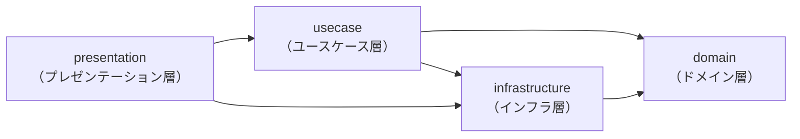
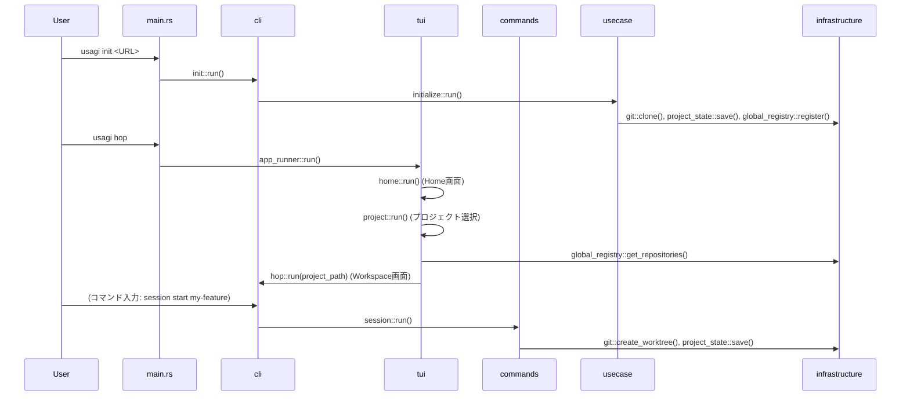

# ソースコードの構造

`src/` はクリーンアーキテクチャの4層で構成されています。
各層は矢印の方向にのみ依存します。

## 依存関係の方向



## ディレクトリ構成

```
src/
├── main.rs                      # CLIエントリポイント・ルーティング
│
├── domain/                      # 【ドメイン層】純粋なエンティティ
│   ├── project.rs               # ProjectState, ProjectConfig, Worktree 構造体
│   └── usagi.rs                 # Repositories 構造体 (グローバル)
│
├── infrastructure/              # 【インフラ層】外部システムとのやりとり
│   ├── project_state.rs         # プロジェクト単体の永続化 (.usagi/state.json)
│   ├── project_history.rs       # プロジェクト単体の履歴管理 (.usagi/history.json)
│   ├── global_registry.rs       # usagi共通のリポジトリ一覧管理 (repositories.json)
│   └── git.rs                   # Gitオペレーション (clone / worktree / branch)
│
├── usecase/                     # 【ユースケース層】ビジネスロジック
│   └── initialize.rs            # `usagi init` の処理フロー
│
└── presentation/                # 【プレゼンテーション層】表示・入力
    ├── tui/                     # ターミナルUI コンポーネント
    │   ├── app_runner.rs        # Home -> ProjectSelect -> Hop の遷移管理
    │   ├── home.rs              # usagi hop 起動時のメインメニュー
    │   ├── project.rs           # プロジェクト選択画面
    │   ├── screen.rs            # AlternateScreenGuard（別スクリーン管理）
    │   ├── mode.rs              # AppMode（モード定義）
    │   └── layout.rs            # 描画ユーティリティ・MenuItem
    ├── cli/                     # CLIコマンドハンドラー
    │   ├── init.rs              # `usagi init` エントリポイント
    │   ├── aws.rs               # `usagi aws` エントリポイント
    │   ├── ai.rs                # `usagi ai` エントリポイント
    │   └── hop.rs               # `usagi hop` (Workspace) メインTUIループ
    └── commands/                # TUI内コマンド実装
        ├── mod.rs               # Command トレイト・コマンド一覧
        ├── ai.rs                # `ai` コマンド
        ├── doctor.rs            # `doctor` コマンド
        ├── history.rs           # `history` コマンド
        ├── man.rs               # `man` コマンド
        ├── session.rs           # `session` コマンド
        ├── space.rs             # `space` コマンド
        └── terminal.rs          # `terminal` コマンド
```

## 各層の責務

### `domain/` — ドメイン層

外部依存を持たない純粋なデータ構造のみを定義します。
フレームワーク・I/O・UIへの依存は一切ありません。

| ファイル | 内容 |
|---|---|
| `project.rs` | `ProjectState`（プロジェクトの状態）、`ProjectConfig`（プロジェクトの設定）、`Worktree` |
| `usagi.rs` | `Repositories`（登録済みリポジトリ一覧：グローバル） |

### `infrastructure/` — インフラ層

ファイルシステムやGitなどの外部システムとのデータのやりとりを担います。
ドメイン層のエンティティを読み書きするための具体的な実装を提供します。

| ファイル | 内容 |
|---|---|
| `project_state.rs` | プロジェクト単体の状態管理。`<project>/.usagi/state.json` の読み書き |
| `project_history.rs` | プロジェクト単体の履歴管理。`<project>/.usagi/history.json` の読み書き |
| `global_registry.rs` | usagi共通のリポジトリ一覧管理。OS標準のデータディレクトリ内 `repositories.json` の読み書き |
| `git.rs` | Git操作（リポジトリのクローン、worktreeの作成、ブランチの確認など） |

### `usecase/` — ユースケース層

アプリケーションのビジネスロジックを担います。
UIやフレームワークに依存せず、ドメイン層とインフラ層を組み合わせて処理フローを定義します。

| ファイル | 内容 |
|---|---|
| `initialize.rs` | `usagi init` コマンドの処理フロー（ディレクトリ作成・クローン・設定ファイル生成） |

### `presentation/` — プレゼンテーション層

ユーザーとのやりとり（表示・入力）を担います。
CLIのルーティング、TUIのレンダリング、インタラクティブなコマンド処理を実装します。

#### `presentation/tui/` — ターミナルUI

| ファイル | 内容 |
|---|---|
| `app_runner.rs` | 画面全体の遷移フロー（Home -> ProjectSelect -> Hop）を制御 |
| `home.rs` | 起動直後のメニュー（Open / New / Config / Quit）を表示 |
| `project.rs` | プロジェクト一覧から一つを選択する画面 |
| `screen.rs` | `AlternateScreenGuard`：別スクリーンへの切り替えとCtrl+C処理 |
| `mode.rs` | `AppMode` enum：SideMenu / Command / Interaction / Execution の4モード |
| `layout.rs` | ウサギキャラクター・サイドメニュー・フッターの描画関数 |

#### `presentation/cli/` — CLIコマンドハンドラー

| ファイル | 内容 |
|---|---|
| `init.rs` | `usagi init` を受け取り、ユースケース層に委譲 |
| `aws.rs` | `usagi aws` コマンドのエントリポイント |
| `ai.rs` | `usagi ai` コマンドのエントリポイント |
| `hop.rs` | `usagi hop` (Workspace画面) のメインTUIイベントループ |

#### `presentation/commands/` — TUI内コマンド

TUI起動中にコマンド入力欄から実行できるコマンドを定義します。

| ファイル | 内容 |
|---|---|
| `mod.rs` | `Command` トレイト定義と、全コマンドのファクトリ関数 |
| `ai.rs` | AI への指示送信（`ai`） |
| `doctor.rs` | システム依存関係の確認（`doctor`） |
| `history.rs` | コマンド履歴の表示（`history`） |
| `man.rs` | コマンドのヘルプ表示（`man [command]`） |
| `session.rs` | セッション（ブランチ＋worktree）の管理（`session start <branch>` など） |
| `space.rs` | ワークスペースの切り替え（`space <worktree>`） |
| `terminal.rs` | 対話型ターミナルの起動（`terminal`） |

## コマンドの呼び出しフロー



## 関連ドキュメント

- [UI（ユーザーインターフェース）の構成と名称](../ui/layout.md)
- [モードの種類と切り替え](../ui/mode.md)
- [グローバルDB（共通リポジトリ管理）](./global.md)
- [プロジェクト設定（usagi.config）](../project/config.md)
- [初期化後のディレクトリ構造](../project/directory.md)
