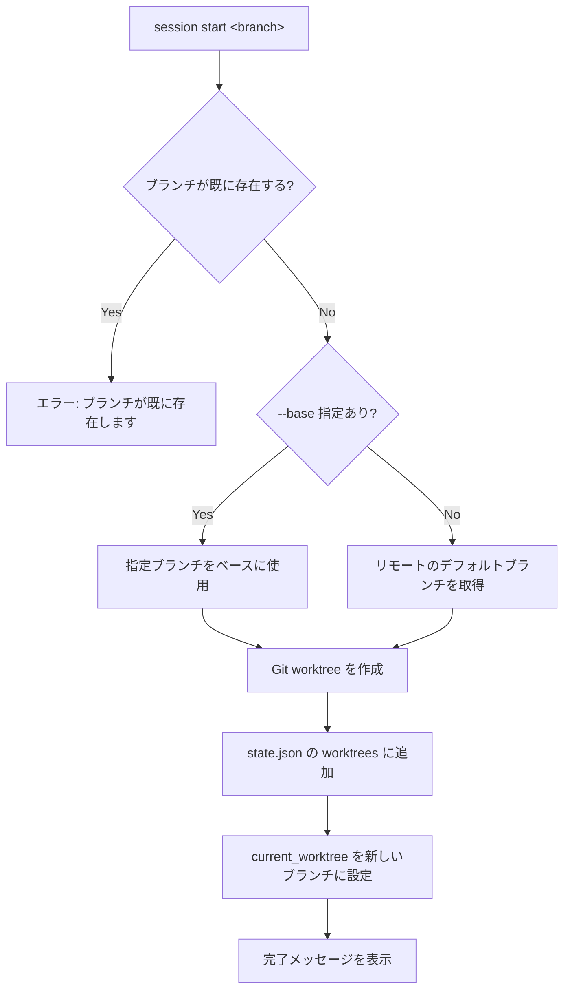

# `session` — セッションの管理

## 概要

`session` コマンドは、作業セッション（Git ブランチ＋ Git worktree）を管理します。
新しいブランチと worktree の作成（`start`）、およびそれらの削除（`close`）を行います。

## 使い方

```
session <SUBCOMMAND>
```

## サブコマンド

### `start` — 新しいセッションを開始

```
session start <BRANCH> [--base <BASE_BRANCH>]
```

| 引数 / オプション | 必須 | 説明 |
|---|---|---|
| `<BRANCH>` | ✅ | 作成するブランチ名 |
| `--base <BASE_BRANCH>` | — | ベースにするブランチ（省略時はリモートのデフォルトブランチ） |

### `close` — セッションを終了して削除

```
session close <BRANCH>
```

| 引数 | 必須 | 説明 |
|---|---|---|
| `<BRANCH>` | ✅ | 終了・削除するブランチ名 |

`close` を実行すると、対応する Git worktree が削除され、**ローカルブランチも強制削除（`git branch -D`）されます。**
作業内容が保存（commit/push）されていることを確認してから実行してください。

### `update` — セッションを更新

```
session update [--all] [--base <BASE_BRANCH>]
```

| 引数 / オプション | 必須 | 説明 |
|---|---|---|
| `--all`, `-a` | — | 現在開いている全てのセッションを更新する |
| `--base <BASE_BRANCH>`, `-b <BASE_BRANCH>` | — | ベースにするブランチ（省略時はリモートのデフォルトブランチ） |

`update` を実行すると、指定したベースブランチ（デフォルトはリモートのデフォルトブランチ）から最新の変更を取り込みます（`git rebase` を使用）。
ベースブランチにリモート名が含まれる場合（例: `origin/main`）、事前に `git fetch` を実行します。

### `status` — セッションの状態を表示

```
session status
```

現在の全てのセッションの状態（ブランチ名、ディレクトリ名、デフォルトかどうか、状態（Open/Closed/Unknown））を表示します。

## 例

```
# デフォルトブランチをベースに my-feature ブランチを作成
session start my-feature

# develop ブランチをベースに hotfix ブランチを作成
session start hotfix --base develop

# 現在のセッションをデフォルトブランチで更新
session update

# 全てのセッションを origin/develop で更新
session update --all --base origin/develop
```

## 処理フロー



## 実行後のディレクトリ構造

```text
<project-root>/
├── .usagi/
│   └── state.json      # worktrees に新しいブランチ名が追記される
├── main/               # メイン worktree
└── <branch-name>/      # 新しく作成された worktree
```

## 関連ドキュメント

- [TUI コマンド一覧](./index.md)
- [`space` コマンド（ワークスペース切り替え）](./space.md)
