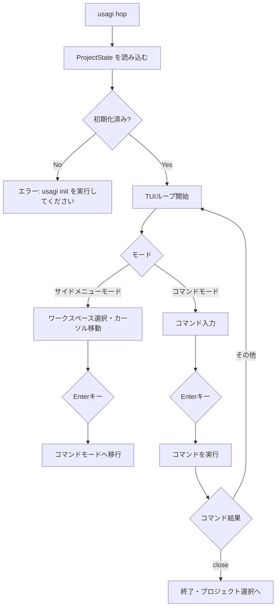

# `usagi hop` — プロジェクト内ターミナル

## 概要

`usagi hop` は、初期化済みプロジェクトディレクトリでメインのターミナル TUI を起動するコマンドです。
左ペインにワークスペース（worktree）一覧、右ペインにコマンド履歴を表示しながら、専用のコマンドラインから各種 TUI コマンドを実行できます。

通常は [`usagi open`](./open.md) 経由で呼び出されますが、初期化済みディレクトリで直接実行することもできます。

## 使い方

```bash
# open 経由（推奨）
usagi open

# 初期化済みディレクトリで直接起動
usagi hop
```

## 画面レイアウト

```
----- USAGI TERMINAL -----
MODE: サイドメニューモード
─────────────────────────────────────────────────
workspace                │ Welcome to usagi terminal! (Workspace: main)
> ●  main                │ session start my-feature
      my-feature         │ space my-feature
                         │
─────────────────────────────────────────────────
COMMAND                  │
─────────────────────────────────────────────────
Use Up/Down to select, Enter to type command, 'q' to quit.
```

| ペイン | 内容 |
|---|---|
| ヘッダー | タイトルと現在のモードを表示 |
| 左ペイン | ワークスペース（worktree）一覧。`●` が現在選択中のワークスペースを示す |
| 右ペイン | コマンド実行履歴 |
| コマンド欄 | コマンドモード時に入力を受け付ける領域 |
| フッター | 操作ヒントを表示 |

## モードと操作

`usagi hop` TUI には2つの主要なモードがあります。詳細は [モードドキュメント](../structure/mode.md) を参照してください。

### サイドメニューモード（デフォルト）

| キー | 操作 |
|---|---|
| `↑` / `↓` | ワークスペース一覧のカーソルを移動 |
| `Enter` | コマンドモードへ移行 |
| `q` | アプリを終了してプロジェクト選択画面へ戻る |

### コマンドモード

| キー | 操作 |
|---|---|
| 文字入力 | コマンドを入力 |
| `Tab` | サジェストからコマンドを補完 |
| `Enter` | コマンドを実行 |
| `Escape` | コマンドをキャンセルしてサイドメニューモードへ戻る |
| `↑` / `↓` | コマンド履歴を遡る |

## オートコンプリート

コマンドモードでは、入力に応じてコマンド名・サブコマンドのサジェストがポップアップ表示されます。

```
COMMAND                  │ session
─────────────────────────── ──────────────────────────────────────────
                             Usage: session <SUBCOMMAND>
                            ┌─────────────────────────────────────────┐
                            │ start     │ Start a new session          │
                            └─────────────────────────────────────────┘
```

## 利用可能な TUI コマンド

| コマンド | 説明 |
|---|---|
| [`ai`](../tui/ai.md) | AI にメッセージを送信する |
| [`close`](../tui/close.md) | セッションを終了してプロジェクト選択画面へ戻る |
| [`history`](../tui/history.md) | コマンド履歴を表示する |
| [`man`](../tui/man.md) | コマンドのヘルプを表示する |
| [`session`](../tui/session.md) | 新しいセッション（ブランチ＋worktree）を作成する |
| [`space`](../tui/space.md) | ワークスペースを切り替える |

## 処理フロー



## 関連ドキュメント

- [TUI コマンド一覧](../tui/index.md)
- [モードの種類と切り替え](../structure/mode.md)
- [`usagi open`](./open.md)
