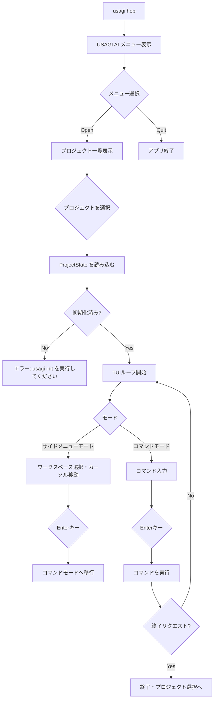

# `usagi hop` — プロジェクト内ターミナル

## 概要

`usagi hop` は、USAGI AI のアスキーアートが表示されるインタラクティブな TUI メニューを開き、そこから初期化済みプロジェクトディレクトリのメインターミナルを起動するコマンドです。
ディレクトリに依存せずどこからでも実行でき、メニューからプロジェクトを選択することで、左ペインにワークスペース一覧、右ペインにコマンド履歴を表示する専用ターミナルへシームレスに移行できます。

## 使い方

```bash
# どこでもいいので実行してメニューを起動
usagi hop
```

## 画面レイアウト

### 1. メニュー画面 (USAGI AI)

```
  (\ \
 (='-')       USAGI AI
 o_(")(")`

  ●  Open       o
  ●  New        e
  ●  Config     c
  ●  Quit       q
```

| メニュー | ショートカットキー | 説明 |
|---|---|---|
| **Open** | `o` | 既存の初期化済みプロジェクトを一覧から選択し、ターミナルモードへ移行します |
| **New** | `e` | （将来の機能や新規プロジェクト作成等） |
| **Config** | `c` | （設定管理など） |
| **Quit** | `q` | アプリを終了します |

### 2. ターミナル画面

メニューで「Open」からプロジェクトを選択すると、以下の画面へ遷移します。

```
----- USAGI TERMINAL -----
MODE: サイドメニューモード
─────────────────────────────────────────────────
workspace                │ Welcome to usagi terminal! (Workspace: main)
> ●  main                │ session start my-feature
      my-feature         │ space my-feature
                         │
─────────────────────────────────────────────────
COMMAND                  │
─────────────────────────────────────────────────
Use Up/Down to select, Enter to type command, 'q' to quit.
```

| ペイン | 内容 |
|---|---|
| ヘッダー | タイトルと現在のモードを表示 |
| 左ペイン | ワークスペース（worktree）一覧。`●` が現在選択中のワークスペースを示す |
| 右ペイン | コマンド実行履歴 |
| コマンド欄 | コマンドモード時に入力を受け付ける領域 |
| フッター | 操作ヒントを表示 |

## モードと操作

`usagi hop` TUI には2つの主要なモードがあります。詳細は [モードドキュメント](../app/ui/mode.md) を参照してください。

### サイドメニューモード（デフォルト）

| キー | 操作 |
|---|---|
| `↑` / `↓` | ワークスペース一覧のカーソルを移動 |
| `Enter` | コマンドモードへ移行 |
| `q` | アプリを終了してプロジェクト選択画面へ戻る |

### コマンドモード

| キー | 操作 |
|---|---|
| 文字入力 | コマンドを入力 |
| `Tab` | サジェストからコマンドを補完 |
| `Enter` | コマンドを実行 |
| `Escape` | コマンドをキャンセルしてサイドメニューモードへ戻る |
| `↑` / `↓` | コマンド履歴を遡る |

## オートコンプリート

コマンドモードでは、入力に応じてコマンド名・サブコマンドのサジェストがポップアップ表示されます。

```
COMMAND                  │ session
─────────────────────────── ──────────────────────────────────────────
                             Usage: session <SUBCOMMAND>
                            ┌─────────────────────────────────────────┐
                            │ start     │ Start a new session          │
                            └─────────────────────────────────────────┘
```

## 利用可能な TUI コマンド

| コマンド | 説明 |
|---|---|
| [`ai`](../app/tui/ai.md) | AI にメッセージを送信する |
| [`doctor`](../app/tui/doctor.md) | システム依存関係の確認 |
| [`history`](../app/tui/history.md) | コマンド履歴を表示する |
| [`man`](../app/tui/man.md) | コマンドのヘルプを表示する |
| [`session`](../app/tui/session.md) | セッション（ブランチ＋worktree）を管理する |
| [`space`](../app/tui/space.md) | ワークスペース（worktree）を切り替える |
| [`terminal`](../app/tui/terminal.md) | 対話型ターミナルの起動 |

## 処理フロー



## 関連ドキュメント

- [TUI コマンド一覧](../app/tui/index.md)
- [モードの種類と切り替え](../app/ui/mode.md)
