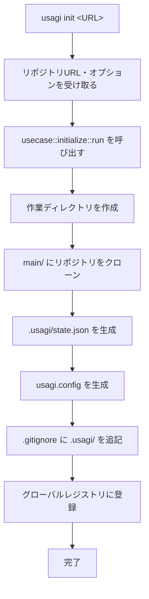

# `usagi init` — リポジトリの初期化

## 概要

`usagi init` は、指定した Git リポジトリを対象にした作業ディレクトリを初期化するコマンドです。
リポジトリのクローンと設定ファイルの生成を行い、`usagi` の各種機能が使える状態にします。

## 使い方

```bash
usagi init <REPOSITORY_URL> [OPTIONS]
```

### 引数・オプション

| 引数 / オプション | 必須 | 説明 |
|---|---|---|
| `<REPOSITORY_URL>` | ✅ | クローンする Git リポジトリの URL |
| `-d`, `--directory <DIR>` | — | 作業ディレクトリ名（省略時はリポジトリ名から自動生成） |
| `-b`, `--branch <BRANCH>` | — | チェックアウトするブランチ名（省略時はデフォルトブランチ） |

### 例

```bash
# 基本的な使い方
usagi init https://github.com/example/my-project

# ディレクトリ名を指定
usagi init https://github.com/example/my-project --directory my-workspace

# ブランチを指定
usagi init https://github.com/example/my-project --branch develop
```

## 処理フロー



## 実行後のディレクトリ構造

```text
<project-root>/
├── .usagi/
│   └── state.json      # 初期化フラグ・ワークツリー一覧を管理する JSON
├── main/               # クローンされたリポジトリ
├── usagi.config        # リポジトリURL などを記録した設定ファイル
└── .gitignore          # .usagi/ を無視する設定が追記される
```

> **メインディレクトリの名称**
> クローン先のディレクトリ名は、デフォルトブランチ名に関わらず常に `main/` となります。

## 関連ドキュメント

- [初期化後のディレクトリ構造](../app/project/directory.md)
- [グローバルDB（共通リポジトリ管理）](../app/architecture/global.md)
