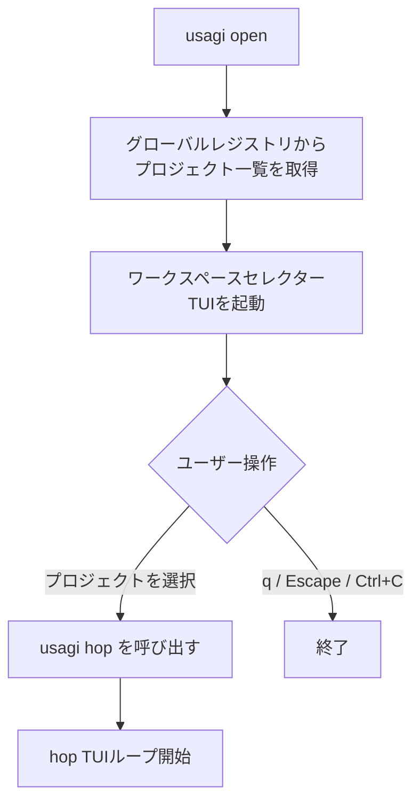

# `usagi open` — ワークスペースセレクター

## 概要

`usagi open` は、グローバルレジストリに登録されている `usagi` プロジェクトをインタラクティブに選択して開くコマンドです。
TUI（ターミナルUI）で一覧を表示し、選択したプロジェクトの `usagi hop` セッションを起動します。

## 使い方

```bash
usagi open
```

引数・オプションはありません。

## 処理フロー



## TUI の操作方法

```
  (\ \
 (='-')       USAGI AI
 o_(")(")`

  ●  Open       o
  ●  New        e
  ●  Config     c
  ●  Quit       q
```

| キー | 操作 |
|---|---|
| `↑` / `↓` | メニュー項目の選択を移動 |
| `Enter` | 選択した項目を実行 |
| `q` / `Escape` / `Ctrl+C` | アプリを終了 |

### メニュー項目

| 項目 | キー | 説明 |
|---|---|---|
| Open | `o` | 登録済みプロジェクト一覧を表示して選択 |
| New | `e` | （将来実装予定）新規プロジェクト作成 |
| Config | `c` | （将来実装予定）設定画面を開く |
| Quit | `q` | アプリを終了 |

### プロジェクト選択モーダル

「Open」を選択すると、登録済みプロジェクトの一覧がモーダルで表示されます。

| キー | 操作 |
|---|---|
| `↑` / `↓` | プロジェクトを選択 |
| `Enter` | 選択したプロジェクトを開く（hop へ遷移） |
| `q` / `Escape` / `Ctrl+C` | モーダルを閉じてメインメニューへ戻る |

## 関連ドキュメント

- [`usagi hop`](./hop.md) — プロジェクト内のターミナルUI
- [グローバルDB（共通リポジトリ管理）](../structure/global.md)
