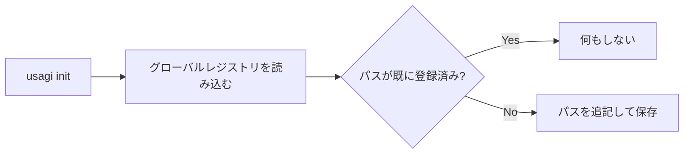

# グローバルなプロジェクト情報管理（共通DB）

`usagi` は、システム全体で初期化済みプロジェクトを追跡するためのグローバルなレジストリを持ちます。
このレジストリは `usagi open` でプロジェクト一覧を表示する際に利用されます。

## 保存場所

OS ごとのユーザーデータディレクトリに保存されます。

| OS | パス |
|---|---|
| macOS | `~/Library/Application Support/usagi/` |
| Linux | `~/.local/share/usagi/` （または `$XDG_DATA_HOME/usagi/`） |
| Windows | `C:\Users\<User>\AppData\Roaming\usagi\data\` |

## 保存ファイル

- **ファイル名**: `repositories.json`
- **フォーマット**: JSON

## データ構造

```rust
struct Repositories {
    repositories: Vec<PathBuf>,
}
```

JSON 形式:

```json
{
  "repositories": [
    "/Users/username/projects/project1",
    "/Users/username/projects/project2"
  ]
}
```

## フィールド説明

| フィールド | 型 | 説明 |
|---|---|---|
| `repositories` | `Vec<String>` | `usagi init` で初期化されたプロジェクトのルートディレクトリの絶対パス一覧 |

## 登録のタイミング

`usagi init` が成功すると、初期化したディレクトリのパスが自動的に `repositories.json` に追記されます。
既に同じパスが登録されている場合は重複して追加されません。



## 参照のタイミング

`usagi open` でプロジェクト一覧を表示する際に、このファイルが読み込まれます。

## 関連ドキュメント

- [プロジェクト設定（usagi.config）](./project_config.md)
- [`usagi init`](../cli/init.md)
- [`usagi open`](../cli/open.md)
