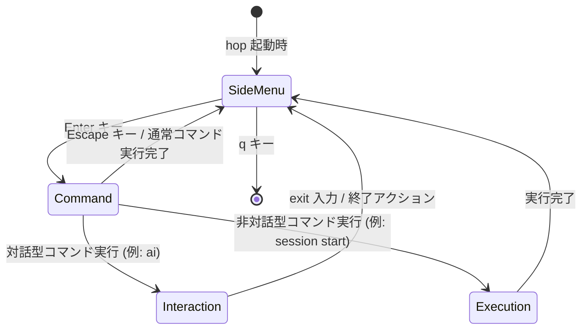

# モードの種類と切り替え

`usagi hop` TUI は以下の4つのモードを持ちます。
各モードはユーザーの操作によって遷移します。

## モード一覧

| モード | 表示名 | 説明 |
|---|---|---|
| `SideMenu` | サイドメニューモード | 左ペインのセッション（ワークスペース）一覧を操作できる状態 |
| `Command` | コマンドモード | 下部のコマンド入力欄でコマンドを入力できる状態 |
| `Interaction` | 相互作用モード | AIチャットなど、特定のコマンドと対話を行っている状態 |
| `Execution` | 実行モード | コマンドが実行中の状態 |

## モード遷移図

## 各モードの詳細

### サイドメニューモード (SideMenu)

`usagi hop` 起動直後のデフォルトモードです。  
左ペインのセッション（worktree）一覧にフォーカスがあたっており、矢印キーでカーソルを移動できます。

**操作:**

| キー | 動作 |
|---|---|
| `↑` / `↓` | セッション一覧のカーソルを移動 |
| `Enter` | コマンドモードへ移行 |
| `q` | アプリを終了 |

### コマンドモード (Command)

画面下部のコマンド入力欄がアクティブになります。  
TUI コマンドを入力して実行できます。入力中はオートコンプリートのポップアップが表示されます。

**操作:**

| キー | 動作 |
|---|---|
| 文字入力 | コマンドを入力 |
| `Tab` | サジェストを補完 |
| `Enter` | コマンドを実行（完了後、通常はサイドメニューモードへ戻る） |
| `Escape` | キャンセルしてサイドメニューモードへ戻る |
| `↑` / `↓` | コマンド履歴を遡る |

### 相互作用モード (Interaction)

AIチャット（`ai` コマンド）など、特定のコマンドが実行され、ユーザーとの継続的なやり取りが必要な状態です。
コンテンツ画面（右ペイン）に対話内容が表示され、コマンド入力欄からメッセージを送ることができます。

**操作:**

| キー | 動作 |
|---|---|
| 文字入力 | メッセージを入力 |
| `Enter` | メッセージを送信 |
| `Escape` | 対話を中断してサイドメニューモードへ戻る |
| `exit` 入力 | 対話を終了してサイドメニューモードへ戻る |
| `↑` / `↓` | 入力履歴を遡る |

### 実行モード (Execution)

コマンドが非同期で実行されている状態です。
実行中のログが表示され、完了すると自動的にサイドメニューモードへ戻ります。

## 関連ドキュメント

- [画面遷移](./transition.md)
- [UI（ユーザーインターフェース）の構成と名称](./ui.md)
- [`usagi hop` コマンド](../cli/hop.md)
- [TUI コマンド一覧](../tui/index.md)
