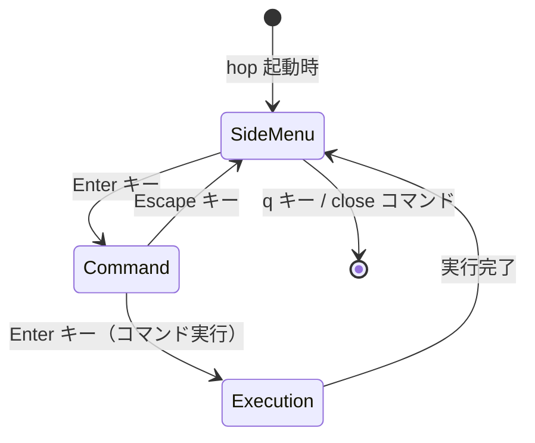

# モードの種類と切り替え

`usagi hop` TUI は以下の4つのモードを持ちます。
各モードはユーザーの操作によって遷移します。

## モード一覧

| モード | 表示名 | 説明 |
|---|---|---|
| `Global` | 全体モード | どのモードにも遷移できる基本の状態 |
| `SideMenu` | サイドメニューモード | 左ペインのワークスペース一覧を操作できる状態 |
| `Command` | コマンドモード | 下部のコマンド入力欄でコマンドを入力できる状態 |
| `Execution` | 実行モード | 選択したコマンドを実行中の状態 |

## モード遷移図

## 各モードの詳細

### 全体モード (Global)

どのモードにも遷移できる基本の状態です。  
現在は `SideMenu` モードの別名として扱われています。

### サイドメニューモード (SideMenu)

`usagi hop` 起動直後のデフォルトモードです。  
左ペインのワークスペース（worktree）一覧にフォーカスがあたっており、矢印キーでカーソルを移動できます。

**操作:**

| キー | 動作 |
|---|---|
| `↑` / `↓` | ワークスペース一覧のカーソルを移動 |
| `Enter` | コマンドモードへ移行 |
| `q` | アプリを終了 |

### コマンドモード (Command)

画面下部のコマンド入力欄がアクティブになります。  
TUI コマンドを入力して実行できます。入力中はオートコンプリートのポップアップが表示されます。

**操作:**

| キー | 動作 |
|---|---|
| 文字入力 | コマンドを入力 |
| `Tab` | サジェストを補完 |
| `Enter` | コマンドを実行（実行モードへ移行） |
| `Escape` | キャンセルしてサイドメニューモードへ戻る |
| `↑` / `↓` | コマンド履歴を遡る |

### 実行モード (Execution)

コマンドが実行されている最中の状態です。  
実行が完了すると自動的にサイドメニューモードへ戻ります。

## 関連ドキュメント

- [`usagi hop` コマンド](../cli/hop.md)
- [TUI コマンド一覧](../tui/index.md)
