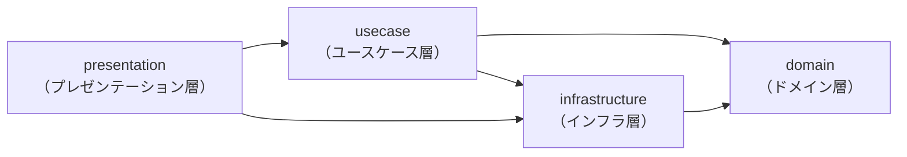
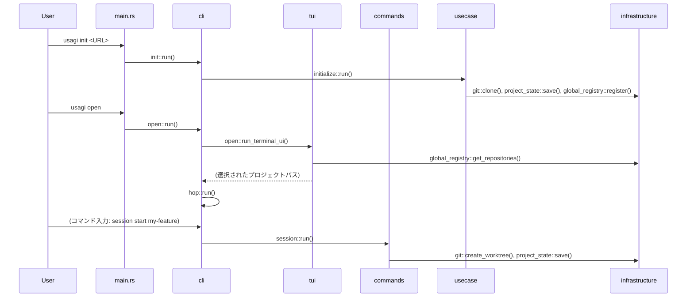

# ソースコードの構造

`src/` はクリーンアーキテクチャの4層で構成されています。
各層は矢印の方向にのみ依存します。

## 依存関係の方向



## ディレクトリ構成

```
src/
├── main.rs                      # CLIエントリポイント・ルーティング
│
├── domain/                      # 【ドメイン層】純粋なエンティティ
│   ├── project.rs               # ProjectState, ProjectConfig, Worktree 構造体
│   └── usagi.rs                 # Repositories 構造体 (グローバル)
│
├── infrastructure/              # 【インフラ層】外部システムとのやりとり
│   ├── project_state.rs         # プロジェクト単体の永続化 (.usagi/state.json)
│   ├── global_registry.rs       # usagi共通のリポジトリ一覧管理 (repositories.json)
│   └── git.rs                   # Gitオペレーション (clone / worktree / branch)
│
├── usecase/                     # 【ユースケース層】ビジネスロジック
│   └── initialize.rs            # `usagi init` の処理フロー
│
└── presentation/                # 【プレゼンテーション層】表示・入力
    ├── tui/                     # ターミナルUI コンポーネント
    │   ├── screen.rs            # AlternateScreenGuard（別スクリーン管理）
    │   ├── mode.rs              # AppMode（モード定義）
    │   ├── layout.rs            # 描画ユーティリティ・MenuItem
    │   └── open.rs              # ワークスペース選択TUI
    ├── cli/                     # CLIコマンドハンドラー
    │   ├── init.rs              # `usagi init` エントリポイント
    │   ├── open.rs              # `usagi open` エントリポイント
    │   └── hop.rs               # `usagi hop` エントリポイント・メインTUIループ
    └── commands/                # TUI内コマンド実装
        ├── mod.rs               # Command トレイト・コマンド一覧
        ├── close.rs             # `close` コマンド
        ├── history.rs           # `history` コマンド
        ├── man.rs               # `man` コマンド
        ├── session.rs           # `session` コマンド
        └── space.rs             # `space` コマンド
```

## 各層の責務

### `domain/` — ドメイン層

外部依存を持たない純粋なデータ構造のみを定義します。
フレームワーク・I/O・UIへの依存は一切ありません。

| ファイル | 内容 |
|---|---|
| `project.rs` | `ProjectState`（プロジェクトの状態）、`ProjectConfig`（プロジェクトの設定）、`Worktree` |
| `usagi.rs` | `Repositories`（登録済みリポジトリ一覧：グローバル） |

### `infrastructure/` — インフラ層

ファイルシステムやGitなどの外部システムとのデータのやりとりを担います。
ドメイン層のエンティティを読み書きするための具体的な実装を提供します。

| ファイル | 内容 |
|---|---|
| `project_state.rs` | プロジェクト単体の状態管理。`<project>/.usagi/state.json` の読み書き |
| `global_registry.rs` | usagi共通のリポジトリ一覧管理。OS標準のデータディレクトリ内 `repositories.json` の読み書き |
| `git.rs` | Git操作（リポジトリのクローン、worktreeの作成、ブランチの確認など） |

### `usecase/` — ユースケース層

アプリケーションのビジネスロジックを担います。
UIやフレームワークに依存せず、ドメイン層とインフラ層を組み合わせて処理フローを定義します。

| ファイル | 内容 |
|---|---|
| `initialize.rs` | `usagi init` コマンドの処理フロー（ディレクトリ作成・クローン・設定ファイル生成） |

### `presentation/` — プレゼンテーション層

ユーザーとのやりとり（表示・入力）を担います。
CLIのルーティング、TUIのレンダリング、インタラクティブなコマンド処理を実装します。

#### `presentation/tui/` — ターミナルUI

| ファイル | 内容 |
|---|---|
| `screen.rs` | `AlternateScreenGuard`：別スクリーンへの切り替えとCtrl+C処理 |
| `mode.rs` | `AppMode` enum：Global / SideMenu / Command / Execution の4モード |
| `layout.rs` | ウサギキャラクター・サイドメニュー・フッターの描画関数 |
| `open.rs` | `usagi open` / `usagi hop` で使うプロジェクト選択TUI |

#### `presentation/cli/` — CLIコマンドハンドラー

| ファイル | 内容 |
|---|---|
| `init.rs` | `usagi init` を受け取り、ユースケース層に委譲 |
| `open.rs` | `usagi open` を受け取り、TUIを起動してhopに遷移 |
| `hop.rs` | `usagi hop` のメインTUIイベントループ |

#### `presentation/commands/` — TUI内コマンド

TUI起動中にコマンド入力欄から実行できるコマンドを定義します。

| ファイル | 内容 |
|---|---|
| `mod.rs` | `Command` トレイト定義と、全コマンドのファクトリ関数 |
| `close.rs` | ターミナルを閉じてプロジェクト選択画面に戻る（`close`） |
| `history.rs` | コマンド履歴の表示（`history`） |
| `man.rs` | コマンドのヘルプ表示（`man [command]`） |
| `session.rs` | 新しいセッション（ブランチ＋worktree）の作成（`session start <branch>`） |
| `space.rs` | ワークスペースの切り替え（`space <worktree>`） |

## コマンドの呼び出しフロー



## 関連ドキュメント

- [UI（ユーザーインターフェース）の構成と名称](./ui.md)
- [モードの種類と切り替え](./mode.md)
- [グローバルDB（共通リポジトリ管理）](./global.md)
- [プロジェクト設定（usagi.config）](./project_config.md)
- [初期化後のディレクトリ構造](./directory.md)
