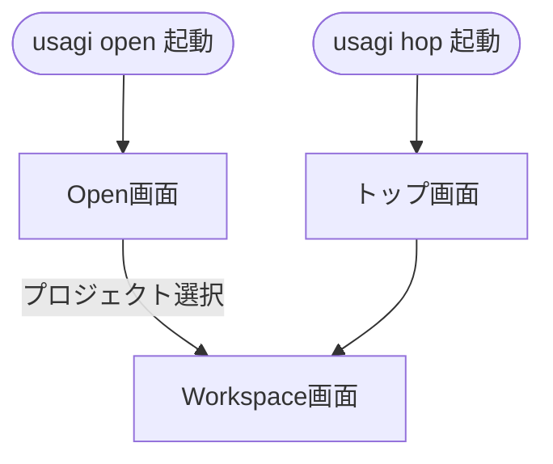

# 画面遷移

`usagi.ai` の主要な画面とその遷移、および画面構成についてまとめます。

## 画面一覧

| 画面名 | 起動コマンド | 説明 |
|---|---|---|
| **トップ画面** | `usagi hop` | 特定のプロジェクトを作業対象として起動した際の初期画面です。 |
| **Open画面** | `usagi open` | 登録済みのプロジェクト（リポジトリ）の一覧を表示し、選択するための画面です。 |
| **Workspace画面** | (Open画面から遷移) | プロジェクトを選択した後に表示される、実際の作業を行うためのメイン画面です。 |

## 画面遷移フロー

## Workspace画面の構成

Workspace画面は、効率的な作業を支援するために以下の3つのセクションで構成されています。

### 1. セッション一覧
画面左側に配置され、プロジェクト内の各セッション（ワークスペース/ワークツリー）を管理・選択できます。

### 2. コマンド入力
画面下部に配置され、AIへの指示やターミナルコマンド、アプリ独自のTUIコマンドを入力・実行できます。

### 3. コンテンツ画面
画面右側のメインエリアです。実行されたコマンドの履歴、AIからの回答、ターミナルの出力結果などが動的に表示されます。

---

## 関連ドキュメント

- [UI（ユーザーインターフェース）の構成と名称](./ui.md)
- [モードの種類と切り替え](./mode.md)
