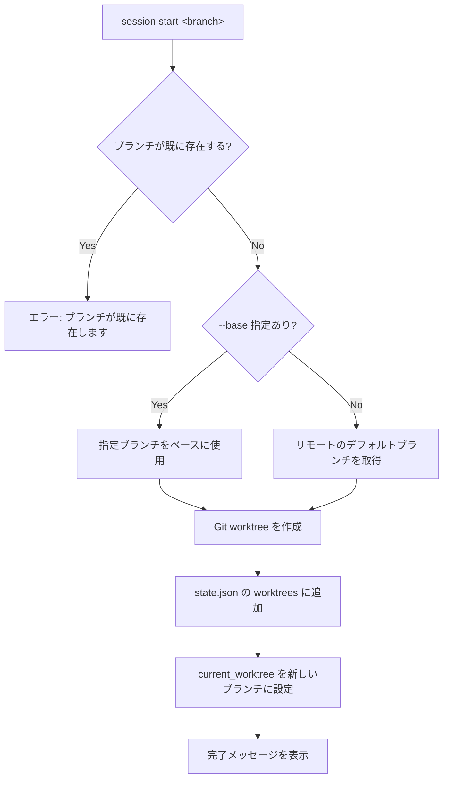

# `session` — セッションの管理

## 概要

`session` コマンドは、新しい作業セッション（Git ブランチ＋ Git worktree）を作成します。
新しいブランチを作成し、そのブランチに対応する worktree を自動的にセットアップします。

## 使い方

```
session <SUBCOMMAND>
```

## サブコマンド

### `start` — 新しいセッションを開始

```
session start <BRANCH> [--base <BASE_BRANCH>]
```

| 引数 / オプション | 必須 | 説明 |
|---|---|---|
| `<BRANCH>` | ✅ | 作成するブランチ名 |
| `--base <BASE_BRANCH>` | — | ベースにするブランチ（省略時はリモートのデフォルトブランチ） |

## 例

```
# デフォルトブランチをベースに my-feature ブランチを作成
session start my-feature

# develop ブランチをベースに hotfix ブランチを作成
session start hotfix --base develop
```

## 処理フロー



## 実行後のディレクトリ構造

```text
<project-root>/
├── .usagi/
│   └── state.json      # worktrees に新しいブランチ名が追記される
├── main/               # メイン worktree
└── <branch-name>/      # 新しく作成された worktree
```

## 関連ドキュメント

- [TUI コマンド一覧](./index.md)
- [`space` コマンド（ワークスペース切り替え）](./space.md)
